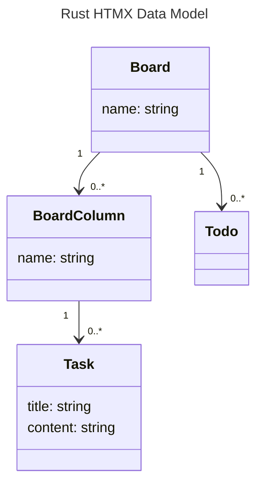

# rust-htmx

## Data Model


```mermaid
---
title: "Rust HTMX Data Model"
---
classDiagram
  class Board {
    name: string
  }
  class Task {
    title: string
    content: string
  }

  class BoardColumn {
    name: string
  }

  Board "1" --> "0..*" Todo
  Board "1" --> "0..*" BoardColumn
  BoardColumn "1" --> "0..*" Task

```
```


