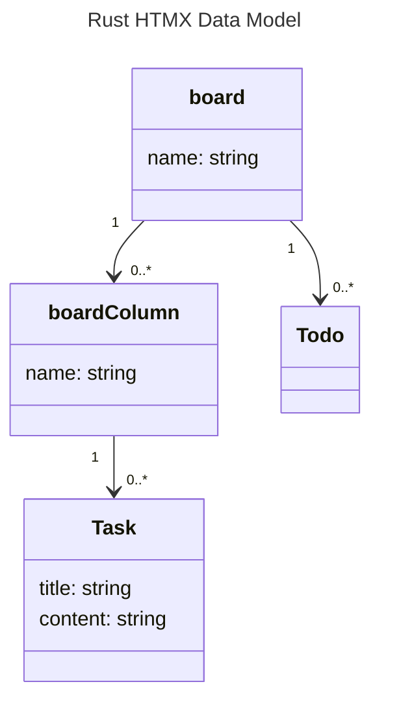

# rust-htmx

## Data Model


```mermaid
---
title: "Rust HTMX Data Model"
---
classDiagram
  class board {
    name: string
  }
  class Task {
    title: string
    content: string
  }

  class boardColumn {
    name: string
  }

  board "1" --> "0..*" Todo
  board "1" --> "0..*" boardColumn
  boardColumn "1" --> "0..*" Task

```
```

## Resources

- [hyperui](https://www.hyperui.dev/)
